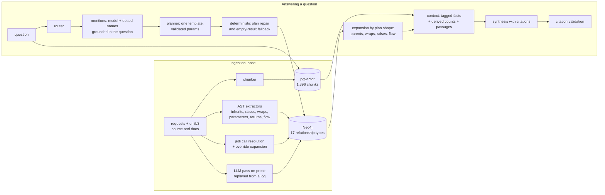

# Blueprint: graph + vector RAG over a codebase, measured

[](https://github.com/aakarshan-coding/blueprint-ai/actions/workflows/tests.yml)

A question-answering system over the source and docs of two Python libraries, `requests`
and `urllib3`. Two retrieval halves share one corpus: a **vector index** of code and prose
chunks, and a **knowledge graph** of 17 relationship types that a parser extracts from the
code (inheritance, calls, raises, what wraps what, where a parameter's value goes). A
planner turns a question into one of a fixed set of Cypher templates; the graph's facts and
the vector passages go to a model that writes a cited answer.

The point of the project is the **measurement**: a 220-question benchmark, run five times
per change because the models are not deterministic, graded mostly without a model, and
audited for the ways a grader can be fooled. The graph's contribution is the gap between
the hybrid system and a vector-only baseline that shares everything else.

**Contents:** [Results](#results) · [How the numbers were earned](#how-the-numbers-were-earned) ·
[Architecture](#architecture) · [Repository map](#repository-map) · [Quickstart](#quickstart) ·
[Limits and open items](#limits-and-open-items) · [Reading further](#reading-further)

## Results

220 questions, five categories, five runs on identical code. Each cell is the mean across
runs; the pooled row shows the worst and best run in brackets. Strict accuracy: a
"partial" answer counts as wrong.

| category | n | hybrid | vector only | lead |
|---|---|---|---|---|
| single-hop (one fact) | 45 | 95.1 | 95.1 | +0.0 |
| two-hop (two linked facts) | 45 | 72.4 | 46.2 | +26.2 |
| three-hop (three linked facts) | 45 | 71.1 | 28.4 | +42.7 |
| aggregation (count or list) | 45 | 81.3 | 14.2 | +67.1 |
| out of scope (should refuse) | 40 | 97.0 | 85.0 | +12.0 |
| **pooled** | 220 | **83.1** [82.3 .. 84.1] | 53.1 [52.3 .. 54.1] | **+30.0** [28.7 .. 31.4] |

With partial credit (the share of each reference's required parts an answer states):
hybrid 88.2, vector only 63.0, lead +25.2 [24.3 .. 26.1].

What the table says, in one line each:

- On single facts the graph is not needed; both halves have the same passages.
- On linked facts the graph's value is in the **last hop**: the baseline usually gets the
  first fact and loses the chain.
- On counting and listing, text search cannot do it; a passage never says "how many
  subclasses". The graph computes it.
- On out-of-scope questions, an empty graph result is a strong refusal signal.

Source: [`results/exp9/`](results/exp9), summarised with
`python -m graphrag.eval.summarize_runs results/exp9/*.json`. Every earlier table is in
[`results/`](results/README.md), mapped to the decision that produced it.

## How the numbers were earned

The project kept a decisions log from the first day:
[`docs/DECISIONS.md`](docs/DECISIONS.md), 91 entries, each with the evidence and the
reversals. The parts that mattered most:

1. **A noise floor before any claim.** `temperature=0` is not deterministic: two runs of
   identical code disagreed on ~12% of verdicts. Every number since is a five-run mean
   with its spread, and a change counts only if its worst run beats the previous best.
   ([D51](docs/DECISIONS.md), [D60](docs/DECISIONS.md))
2. **A runtime oracle for the graph itself.** The `requests` test suite runs under
   `sys.settrace`; every observed call, raise and exception-wrap is scored against the
   graph's edges. Parser-extracted wrap edges are right 71% of the time, model-extracted
   ones 29%, which decided the parser-for-structure, model-for-prose split.
   ([D67](docs/DECISIONS.md), [`results/oracle/`](results/oracle))
3. **The biggest gains were plumbing, found by reading one failing context.** A dedupe
   keyed on chunk id was discarding every fact after the first from the same chunk; nine
   raise edges reached the model as one. A chain template stopped one hop short of the
   question. A plan anchored on a function ran a query only exceptions can satisfy. Three
   retrieval fixes took three-hop from 30 to 67; no model changed.
   ([D71](docs/DECISIONS.md)–[D74](docs/DECISIONS.md))
4. **The grader was audited against itself.** Seven questions could be passed by echoing
   the question; class names matched prose ("read timeout" satisfied `Timeout`); a hedge
   in a later sentence cancelled an assertion; "the context does not say, however here is
   an answer" counted as a refusal. All fixed, with a test that no question passes its own
   grader; every fix made the grader stricter, and the strictness landed on the baseline.
   ([D79](docs/DECISIONS.md), [D87](docs/DECISIONS.md))
5. **References were corrected when the system was right.** Four of the hand-written
   answers were wrong (one counted typing overloads as functions). The 130 questions added
   last take their references from an independent parse of both libraries, with every
   count computed and asserted before it is written. ([D88](docs/DECISIONS.md))

Grading: 180 questions by required terms (no model), 40 by a refusal check (no model),
10 by a model judge that lists the reference's key facts and which are missing, with the
verdict derived from that list rather than chosen.

## Architecture



The pieces, and where each lives:

| stage | what it does | code |
|---|---|---|
| Ontology | 8 entity types, 17 relationship types, the legend the answer model is shown | [`graphrag/ontology.py`](graphrag/ontology.py) |
| Chunking | code chunks are symbols; doc chunks are sections; one `chunk_id` joins graph and vectors | [`ingest/chunk.py`](graphrag/ingest/chunk.py) |
| Parser extraction | bases, raises, `except X: raise Y`, signatures, return annotations, where a parameter's value is passed next | [`ingest/ast_extract.py`](graphrag/ingest/ast_extract.py) |
| Call resolution | jedi (`goto` first, `infer` second), plus edges to every override of a called base method | [`ingest/jedi_calls.py`](graphrag/ingest/jedi_calls.py) |
| Name resolution | a ladder of rungs from exact id to builtin, each one a decision in the log | [`ingest/resolve.py`](graphrag/ingest/resolve.py) |
| Templates | the only Cypher that ever runs; every parameter validated by kind | [`retrieval/cypher_templates.py`](graphrag/retrieval/cypher_templates.py) |
| Planner | mentions → candidates from the live graph → one template; `repair_plan` fixes the shapes the small model gets wrong | [`retrieval/graph_query.py`](graphrag/retrieval/graph_query.py) |
| Retrieval | the one sequence both the pipeline and the probes use: route, plan, run, fall back, expand, rank, assemble | [`retrieval/retrieve.py`](graphrag/retrieval/retrieve.py) |
| Context | facts verbalised with provenance `(code)`/`(docs)`, derived count and listing lines, a legend | [`retrieval/merge.py`](graphrag/retrieval/merge.py) |
| Grading | term matching, refusal check, report-based judge, partial credit | [`eval/grade.py`](graphrag/eval/grade.py) |
| Benchmark | 220 questions, both systems, same prompt; five-run summaries | [`eval/run_benchmark.py`](graphrag/eval/run_benchmark.py), [`eval/summarize_runs.py`](graphrag/eval/summarize_runs.py) |
| Oracle | the graph scored against a trace of the real test suite | [`eval/runtime_oracle.py`](graphrag/eval/runtime_oracle.py) |

Two design rules run through all of it. **The model never writes a query**: it picks a
template and fills typed parameters, which is both the security boundary and what makes a
plan reproducible. **Repairs act on what the graph proves, not on labels**: a plan that
returns nothing falls back; a rule that guessed from an unreliable label once emptied
five flagship questions and was replaced ([D77](docs/DECISIONS.md)).

## Repository map

```
graphrag/            the package (6,500 lines)
  ontology.py        entity and relationship types, with meanings
  ingest/            chunking, extraction, resolution, graph and vector loading
  retrieval/         router, planner, templates, expansion, context assembly
  answer/            synthesis prompt and citation validation
  eval/              grader, benchmark, five-run summaries, runtime oracle
tests/               380 unit tests, no database or model needed (5,700 lines)
docs/DECISIONS.md    the decisions log, D1–D91: what was tried, measured, kept, reversed
docs/research/       how other tools build code knowledge graphs; a deep read of code-graph-rag
results/             every benchmark run cited in the log, mapped to its decision
data/                the LLM extraction log, replayed so ingestion makes no model calls
scripts/             fetch the corpus at pinned commits; reproduce the table end to end
```

## Quickstart

Needs Docker, Python 3.12+, and an OpenAI key (the router, planner and synthesis use
`gpt-4o-mini` and `gpt-4o`; a full benchmark run is about $3).

```bash
git clone https://github.com/aakarshan-coding/blueprint-ai.git && cd blueprint-ai
pip install -e ".[embed,dev]"
scripts/fetch_corpus.sh                 # requests + urllib3 at the measured commits
docker compose up -d                    # Neo4j 5 and pgvector
python -m graphrag.ingest.run_ingestion --ast-only   # parser-derived graph, vector store
python -m graphrag.ingest.replay_llm_edges           # model-derived edges, from the log
export OPENAI_API_KEY=sk-...
python -m graphrag.eval.run_benchmark               # one run, ~28 minutes
```

The unit tests need none of that: `pip install -e ".[dev]" && pytest`.

To reproduce the table rather than one run, `scripts/reproduce.sh` does the five runs and
summarises them. To check the graph against real execution,
`python -m graphrag.eval.runtime_oracle -- requests_repo/tests` (about 3 minutes).

## Limits and open items

- **Two libraries.** Nothing here is measured on another codebase. The ontology and the
  templates are general; the question set and the numbers are not.
- **Two-hop is the weakest graph category at 72.** Its remaining misses are urllib3
  exception questions where the planner anchors on the wrong one of two similarly named
  classes.
- **The planner drifts with a longer template list.** Two questions changed template on
  identical candidates when the list grew from six to eight. Deterministic repairs cover
  the shapes seen so far; planner voting is the untested alternative.
- **Value flow stops at attributes.** Flow through dict literals, `update()`, returned
  dicts and `**kwargs` is followed; a value stored on `self` and read back later is not.
- **Ten judge-graded questions are unaudited against human labels.** The judge once
  contradicted its own structured output in prose; only the structured field is scored.

The full list is at the end of [`docs/DECISIONS.md`](docs/DECISIONS.md), under *Open items*.

## Reading further

- [`docs/DECISIONS.md`](docs/DECISIONS.md): start at D51 (the noise floor), D67 (the
  oracle), D72 (the dedupe bug), D79 (the grader audit), D89–D91 (the 220-question set).
- [`docs/research/2026-09-24-codebase-knowledge-graphs.md`](docs/research/2026-09-24-codebase-knowledge-graphs.md):
  eleven tools that build graphs from code, cited, and what this project took from each.
- [`docs/research/2026-09-26-code-graph-rag.md`](docs/research/2026-09-26-code-graph-rag.md):
  a close read of the nearest open-source project, and why its free-Cypher design was not adopted.
- [`docs/superpowers/specs/2026-09-16-graph-rag-design.md`](docs/superpowers/specs/2026-09-16-graph-rag-design.md):
  the original design document, before any of the above was learned.
